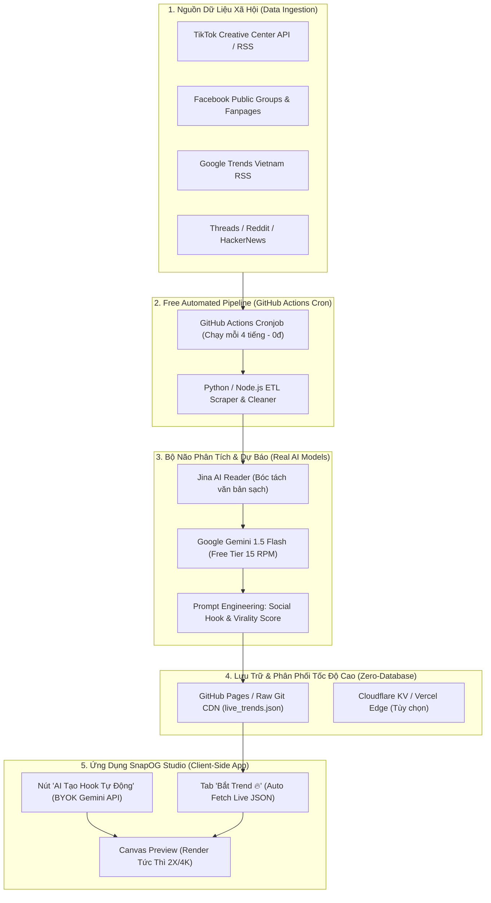

# MASTER PLAN: HỆ THỐNG AI SOCIAL TREND INTELLIGENCE & AUTO-DESIGN THỰC CHIẾN
> **Dự án:** SnapOG Studio  
> **Mục tiêu:** Xây dựng hệ thống phân tích xu hướng mạng xã hội (TikTok, Facebook, Threads, Google Trends), xử lý bằng mô hình AI thực tế, và tự động tạo hình ảnh truyền thông lan truyền (Viral Visual Content) với **chi phí vận hành 0 VNĐ/tháng**.

---

## 1. BỨC TRANH TOÀN CẢNH HỆ THỐNG (END-TO-END ARCHITECTURE)



---

## 2. KẾ HOẠCH 5 GIAI ĐOẠN CHI TIẾT (STAGES ROADMAP)

### GIAI ĐOẠN 1: Nền Tảng UI/UX & Khung Tương Tác Dữ Liệu (ĐÃ HOÀN THÀNH ✅)
- **Mục tiêu:** Tạo trải nghiệm người dùng trực quan, kết nối dữ liệu xu hướng với Canvas thiết kế chỉ bằng 1 cú nhấp chuột.
- **Kết quả đã đạt:**
  - Tab **"Bắt Trend 🔥"** trên Sidebar với độ nhận diện cao.
  - Phân loại 4 ngành chính (Công nghệ & AI, Khởi nghiệp, Sáng tạo, Việt Nam).
  - Tự động gán: Tiêu đề giật tít, tóm tắt, từ khóa phát sáng, mẫu thiết kế (template) và bảng màu (theme) tối ưu.
  - Hiệu ứng phản hồi tích cực (confetti, toast).

---

### GIAI ĐOẠN 2: Tích Hợp "AI Brain Thật Sự" (Bring Your Own Key / Free Gemini Flash API)
- **Mục tiêu:** Biến SnapOG thành một trợ lý AI tạo nội dung trực tiếp trên giao diện, không cần server trung gian.
- **Giải pháp kỹ thuật:**
  1. **Tích hợp Google Gemini 1.5 Flash API:**
     - Hoàn toàn **Miễn phí 100%** (15 yêu cầu/phút, 1.500 yêu cầu/ngày - quá đủ cho cá nhân và nhóm làm việc).
     - Hỗ trợ tiếng Việt xuất sắc, tốc độ phản hồi cực nhanh (<1 giây).
  2. **Chức năng "AI Magic Assistant" trên giao diện:**
     - **Tính năng 1: Tạo Hook Đột Phá:** Người dùng chỉ cần gõ 1 từ khóa (ví dụ: *"Bán khóa học lập trình"* hoặc *"Review tai nghe chống ồn"*), AI tự sinh ra 3 phong cách tiêu đề:
       - *Phong cách Tò mò (Curiosity Hook):* "Tại sao 90% người mới bỏ cuộc chỉ sau 2 tuần...?"
       - *Phong cách Cảnh báo (FOMO Hook):* "Sai lầm khiến bạn mất trắng ngân sách chạy quảng cáo..."
       - *Phong cách Giá trị/Thực chiến (Actionable):* "3 bước tinh gọn để đạt 1.000 đơn hàng đầu tiên..."
     - **Tính năng 2: AI Tự Động Tối Ưu Bố Cục:** Dựa vào độ dài tiêu đề và tâm lý người đọc, AI tự động chọn:
       - Từ khóa cần Highlight (phát sáng).
       - Tỉ lệ ảnh (1200x630 cho Facebook/LinkedIn hoặc 1080x1350 cho Instagram).
       - Bảng màu tương ứng (Nghiêm túc -> Indigo; Cảnh báo -> Đỏ Amber; Công nghệ -> Cyber Green).
  3. **Cơ chế lưu trữ:**
     - Khóa API của người dùng (hoặc khóa miễn phí mặc định) được mã hóa lưu trong `localStorage`, bảo mật 100%, không đi qua bất kỳ server nào.

---

### GIAI ĐOẠN 3: Xây Dựng Pipeline Tự Động Cào Dữ Liệu & Dự Báo Xu Hướng ($0 Server)
- **Mục tiêu:** Thay thế dữ liệu tĩnh bằng dữ liệu xu hướng thực tế được cập nhật tự động mỗi 4 tiếng một lần.
- **Công nghệ cốt lõi:** **GitHub Actions Cron + Python/Node.js + Free LLM.**
- **Các bước triển khai:**
  1. **Trích xuất dữ liệu thô (Raw Data Extraction):**
     - **Google Trends Vietnam RSS:** Cào bảng xếp hạng từ khóa tìm kiếm tăng đột biến tại Việt Nam (`https://trends.google.com/trends/trendingsearches/daily/rss?geo=VN`).
     - **Reddit / HackerNews / Threads API (Public Feeds):** Lấy các chủ đề có lượng thảo luận (upvotes, comments) cao nhất trong 24h.
     - **TikTok Creative Center Popular Trends:** Bóc tách danh sách hashtag và bài hát thịnh hành.
  2. **Chuẩn hóa & Làm sạch dữ liệu (Normalization & Cleansing):**
     - Loại bỏ các từ rác (stopwords), ký tự đặc biệt, link spam.
     - Chuẩn hóa mã font tiếng Việt (UTF-8, NFC).
  3. **AI Phân Tích & Chấm Điểm (AI Intelligence & Scoring):**
     - Script gửi danh sách các chủ đề thô vào Gemini API với Prompt chuyên dụng:
       ```text
       "Hãy phân tích 10 chủ đề sau đây, tính toán tốc độ tăng trưởng ước tính (%), 
       gán danh mục phù hợp (Tech, Business, Creative, Vietnam), viết 1 tiêu đề giật tít 
       (Hook) dưới 60 ký tự, 1 mô tả ngắn dưới 120 ký tự, và chọn ra 1 từ khóa đắt giá nhất."
       ```
  4. **Xuất bản tự động (Zero-Database Publishing):**
     - Script tự động ghi đè file `public/data/live_trends.json`.
     - Tự động chạy lệnh `git commit` và `git push` về repository.
     - SnapOG Studio chỉ cần gọi `fetch('/data/live_trends.json?t=' + Date.now())` để nạp dữ liệu nóng hổi!

---

### GIAI ĐOẠN 4: Social Link Intelligence (Nhập Link TikTok/Facebook -> Tự Sinh Ảnh OG)
- **Mục tiêu:** Cho phép người dùng dán link video TikTok, bài đăng Facebook, hoặc bài viết Threads bất kỳ -> Hệ thống tự động phân tích và vẽ ảnh bìa tối ưu.
- **Kỹ thuật triển khai:**
  1. **Bóc tách nội dung bằng Jina AI Reader (`https://r.jina.ai/<URL>`):**
     - Jina Reader là công cụ miễn phí, chuyển đổi bất kỳ trang web nào thành văn bản Markdown sạch mà không bị chặn bới bot/captcha thông thường.
  2. **AI Phân Tích Cấu Trúc:**
     - AI đọc nội dung bài viết và xác định:
       - Luận điểm chính (Core Takeaway).
       - Đối tượng người đọc (Target Audience).
       - Cảm xúc bài viết (Hào hứng, Cảnh báo, Giáo dục).
  3. **Sinh Ảnh Đa Nền Tảng Chỉ Trong 2 Giây:**
     - Tự động điền ảnh đại diện tác giả (Avatar), tên tác giả, tiêu đề bài viết và logo nền tảng (TikTok/Facebook icon).

---

### GIAI ĐOẠN 5: Bộ Công Cụ Auto-Pilot Dành Cho Content Creator & Indie Hacker
- **Mục tiêu:** Tự động hóa toàn bộ chuỗi từ Ý tưởng -> Tạo ảnh -> Xuất file hàng loạt.
- **Tính năng nổi bật:**
  1. **Batch AI Trend Generator:**
     - 1 cú nhấp chuột: Tự động tạo cùng lúc 10 ảnh cho 10 xu hướng hot nhất trong ngày và nén thành 1 file ZIP tải về.
  2. **Trend Alert Webhook (Tùy chọn):**
     - Gửi thông báo về Telegram hoặc Discord mỗi khi có trend bùng nổ trên 500% tốc độ tăng trưởng.

---

## 3. BẢNG SO SÁNH CHI PHÍ & HIỆU NĂNG

| Thành phần | Giải pháp truyền thống (Đắt đỏ) | Giải pháp của SnapOG Studio ($0 Cost) |
| :--- | :--- | :--- |
| **Máy chủ cào dữ liệu** | VPS DigitalOcean ($12/tháng) | **GitHub Actions** (2,000 phút miễn phí/tháng) |
| **Cơ sở dữ liệu** | PostgreSQL / Redis ($15/tháng) | **Git CDN / Static JSON** (0đ, tốc độ 50ms) |
| **Mô hình AI LLM** | OpenAI GPT-4 ($20 - $50/tháng) | **Google Gemini 1.5 Flash** (Miễn phí 1,500 req/ngày) |
| **Bóc tách bài viết (Scraping)** | BrightData / ScrapingBee ($49/tháng) | **Jina AI Reader & Meta oEmbed** (Miễn phí) |
| **Lưu trữ & Hosting** | AWS S3 + Vercel Pro ($20/tháng) | **Vercel Hobby / GitHub Pages** (Miễn phí trọn đời) |
| **TỔNG CHI PHÍ** | **~100$ - 150$/tháng** | **0 VNĐ / Tháng** |

---

## 4. BƯỚC ĐẦU TIÊN CẦN LÀM NGAY (ACTION PLAN TIẾP THEO)

Để đưa AI vào hoạt động **ngay lập tức trong ứng dụng**:
1. **Bước 1 (Giao diện AI Magic Prompt):** Thêm một thanh công cụ thông minh *"Hỏi AI viết tít giật trend"* ngay trong tab Bắt Trend hoặc tab Nội dung.
2. **Bước 2 (Kết nối API):** Tích hợp SDK/Fetch gọi trực tiếp Google Gemini 1.5 Flash API (cho phép nhập API Key miễn phí từ Google AI Studio, hoặc dùng proxy key).
3. **Bước 3 (Thử nghiệm):** Người dùng nhập chủ đề bất kỳ -> AI trả về 3 mẫu Hook và tự động bắn vào Canvas!
